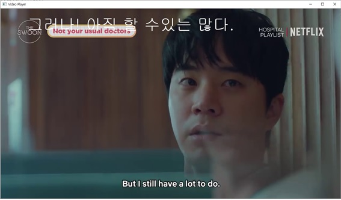
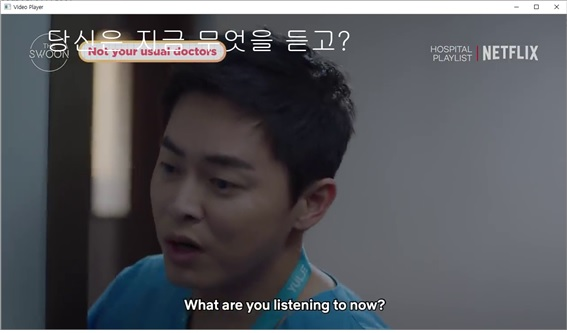

# MutiM
OpenCV_project

<h3> OpenCV-based-project for my multimedia class </h3>
<li>Image to text using pytesseract</li>
<li>Converting enlish into korean</li>
<li>Pasting the text to image</li>
<li>Extend it from images to videos</li>

<h4>install step</h4>
<li>install tesseract: https://github.com/tesseract-ocr/tesseract</li>
<li>install pytesseract: pip install pytesseract</li>
<li>install googletranslate: pip install googletrans</li>
<li>install moviepy: pip install moviepy</li>
<li>install pygame: pip install pygame</li>

<h4>project preview</h4>

